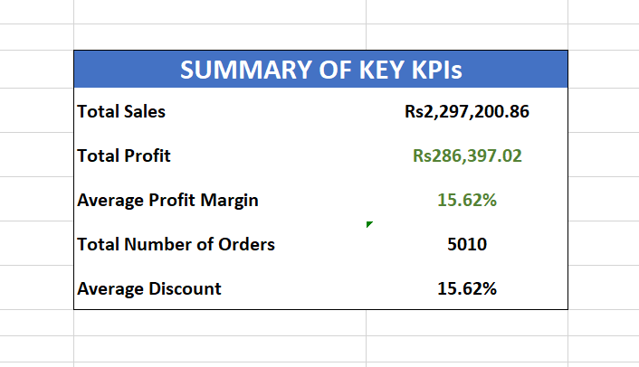
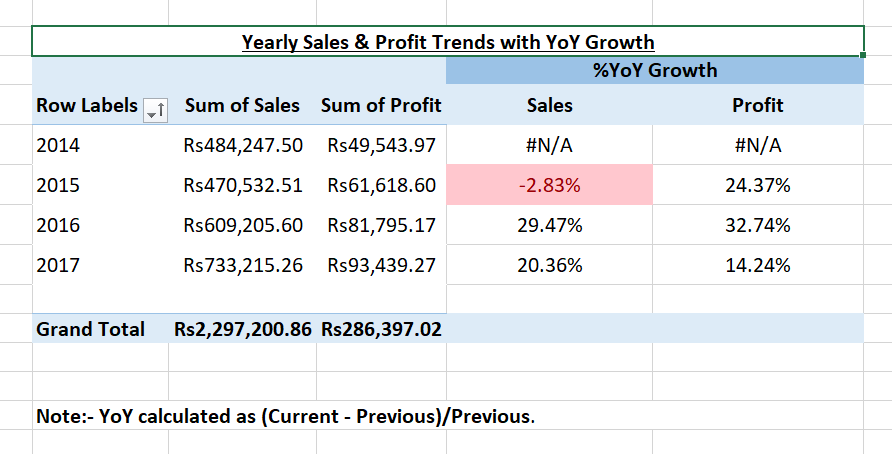
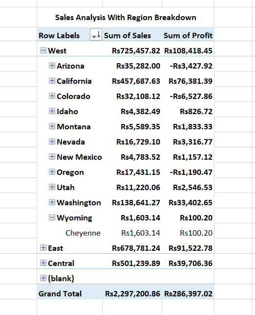
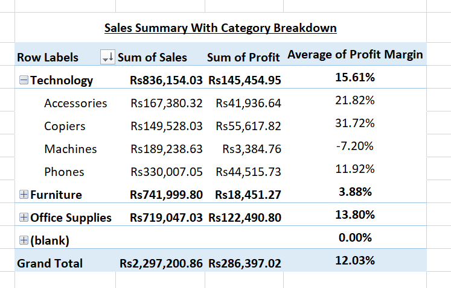
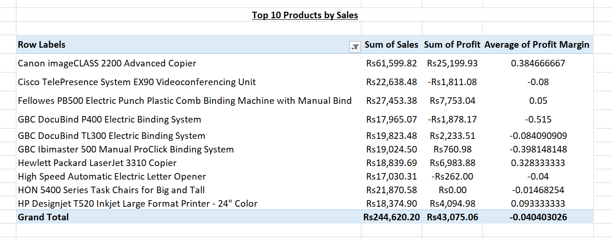

# Superstore Sales Dashboard: Business Insights from Retail Data

## Project Overview
Analyzed ~10,000 transactions (2014-2017) to uncover revenue drivers and profit opportunities. Demonstrates Excel cleaning, PivotTables, SQL queries, and (soon) Power BI dashboard.

**Business Impact**: Identified loss-makers and growth strategies for a retail chain.

**Tools**: Excel, SQL, Power BI.

Dataset: [Kaggle Superstore](https://www.kaggle.com/datasets/vivek468/superstore-dataset-final)

## Key Metrics

<image-card alt="Superstore Summary KPIs" src="visuals/1.png" ></image-card>

<image-card alt="Yearly Trends with YoY Growth" src="visuals/8.png" ></image-card>
- Total Sales: Rs2,297,201
- Total Profit: Rs286,397 (12.5% margin)
- Unique Orders: 5,010
- Avg Discount: 15.6%
- YoY Sales Growth (2017): +20.3%

## Key Insights
- **Regional Leader**: West (Rs725K sales)—expand inventory.
- **Category Stars**: Technology (36% profits, high margin).
- **Loss Makers**: Tables/Bookcases (-Rs19K combined from >20% discounts). **Action**: Cap discounts at 15%.
- **Trends**: Sales +20% in 2017; Q4 peaks—boost holiday marketing.

## Excel Analysis
- Cleaned data (added Margin/Year columns).
- PivotTables for breakdowns.

<!-- Add more  for others -->

## SQL Queries
See [data_cleaning.sql](scripts/data_cleaning.sql) for totals and filters.

## Next: Power BI Dashboard
Interactive version coming (PBIX file).

Built by MJS | [LinkedIn/GitHub] | Open to data roles!
